# App Flow
# Themis

## 1. App Flow Overview

Themis has four main actor paths:

1. Citizen path: legal search, issue assessment, drafts, cases, documents, hearings, legal aid, RTI.
2. Lawyer path: registration, verification, request handling, assigned case work, hearings.
3. Admin path: verification, legal content management, users, audit logs, metrics.
4. Background system path: OCR, PDF export, reminders, notifications, audit events.

## 2. Global Authentication Flow

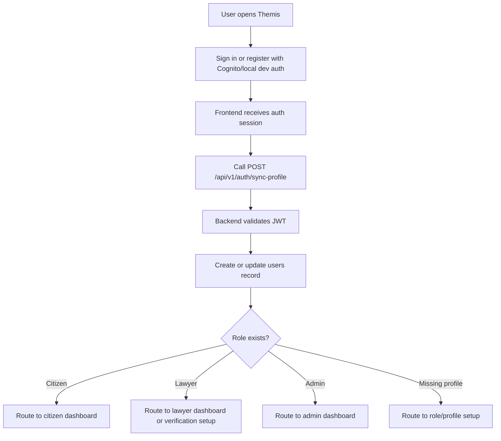

Rules:

1. Production registration and password reset happen in the managed identity provider.
2. The backend stores profile and role data only.
3. Inactive users are blocked after JWT validation.
4. Role-specific dashboards must not load cross-role data.

## 3. Citizen Flow

### 3.1 Citizen Onboarding

```text
Register or sign in
-> Select citizen role
-> Complete profile: name, phone, state, district, language
-> Accept platform disclaimer
-> Citizen dashboard
```

Profile completion requirements:

1. Full name.
2. Email from auth provider.
3. Phone.
4. State.
5. District.
6. Preferred language.
7. Optional address.
8. Optional emergency contact.

### 3.2 Legal Search Flow

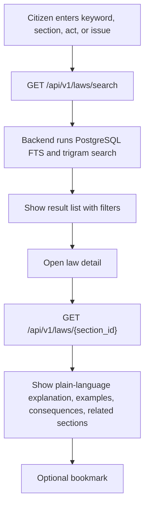

Exit points:

1. Start assessment.
2. Create case.
3. Save section.
4. Return to dashboard.

### 3.3 Guided Assessment Flow

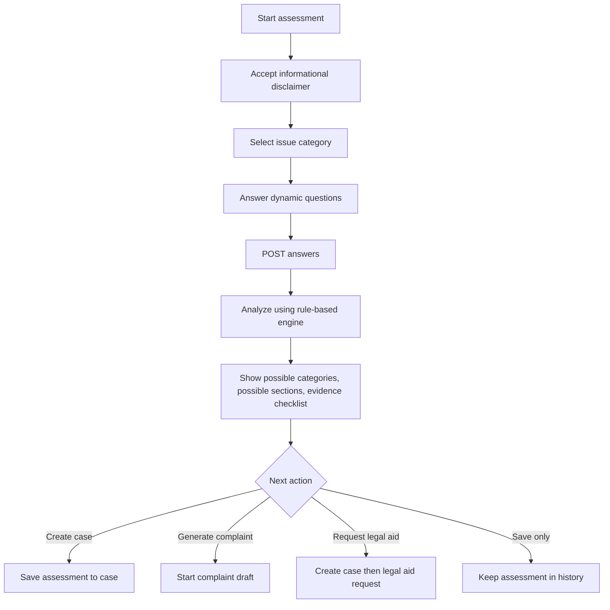

Assessment inputs:

1. Issue category.
2. State and district.
3. Incident date.
4. Incident location.
5. Incident description.
6. Harm details.
7. Money or property involved.
8. Digital evidence available.
9. Minor involved.
10. Accused known.
11. Police contacted.
12. Documents available.
13. Urgency.
14. Preferred language.
15. Create case decision.

### 3.4 Complaint Draft Flow

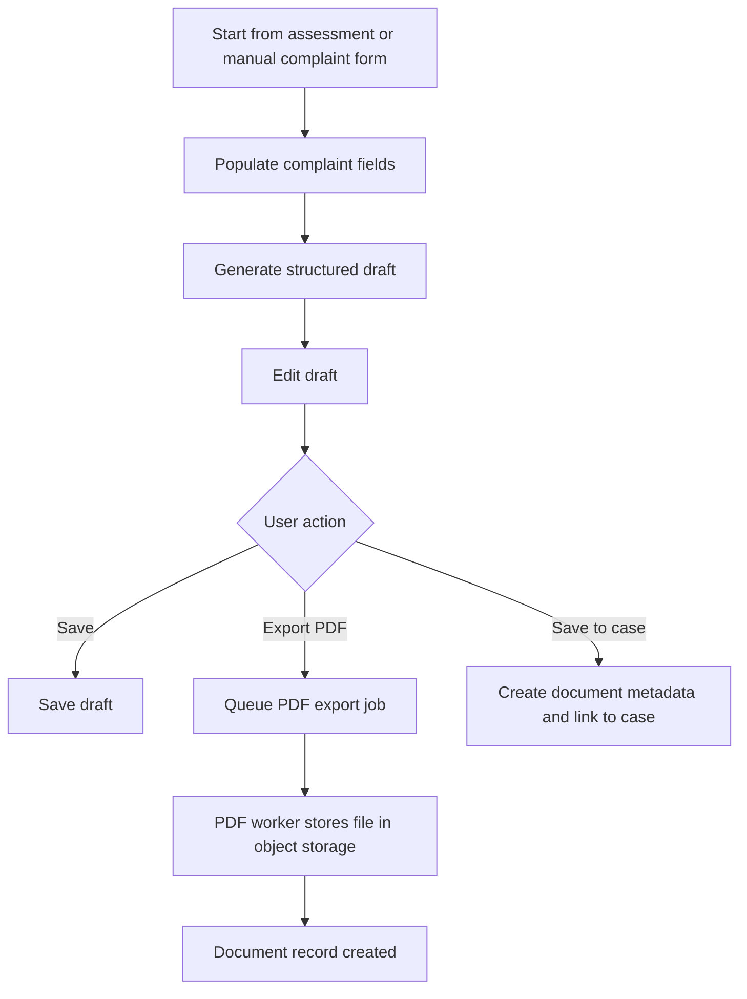

Required draft sections:

1. Complainant details.
2. Authority or police station.
3. Incident date, time, and place.
4. Accused details if known.
5. Incident narrative.
6. Witnesses.
7. Evidence list.
8. Possible legal sections.
9. Requested action.
10. Date, place, signature placeholder.
11. Attachments checklist.

### 3.5 Case Creation Flow

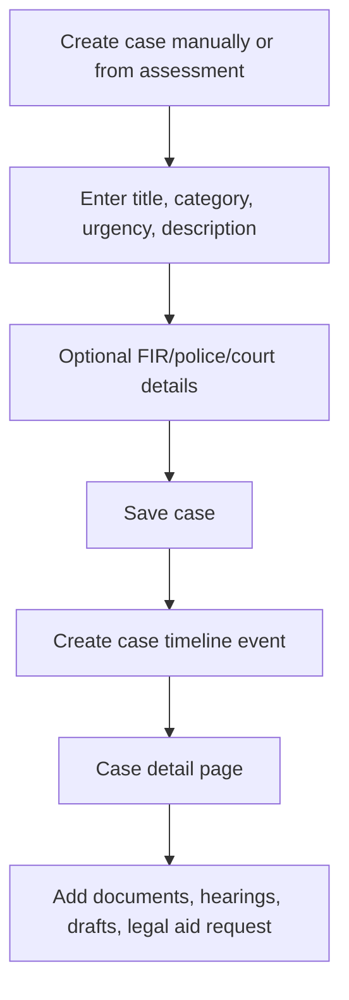

Case status path:

```text
draft
-> assessment_completed
-> complaint_prepared
-> complaint_submitted
-> fir_filed
-> under_investigation
-> legal_aid_requested
-> lawyer_assigned
-> in_court
-> hearing_scheduled
-> awaiting_order
-> closed
-> archived
```

Statuses do not need to be strictly linear in all cases, but every status change must create a timeline event.

### 3.6 Document Upload and OCR Flow

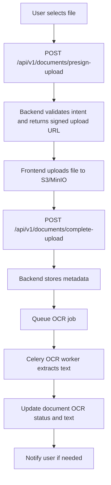

Access rules:

1. Citizen can access documents attached to their case.
2. Lawyer can access documents only after assignment.
3. Admin access is logged.
4. Files are never public.

### 3.7 Hearing and Reminder Flow

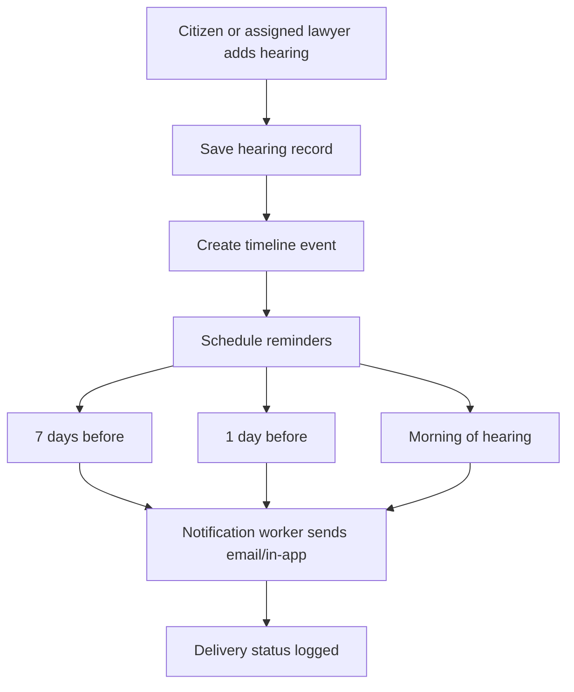

### 3.8 Legal Aid Request Flow

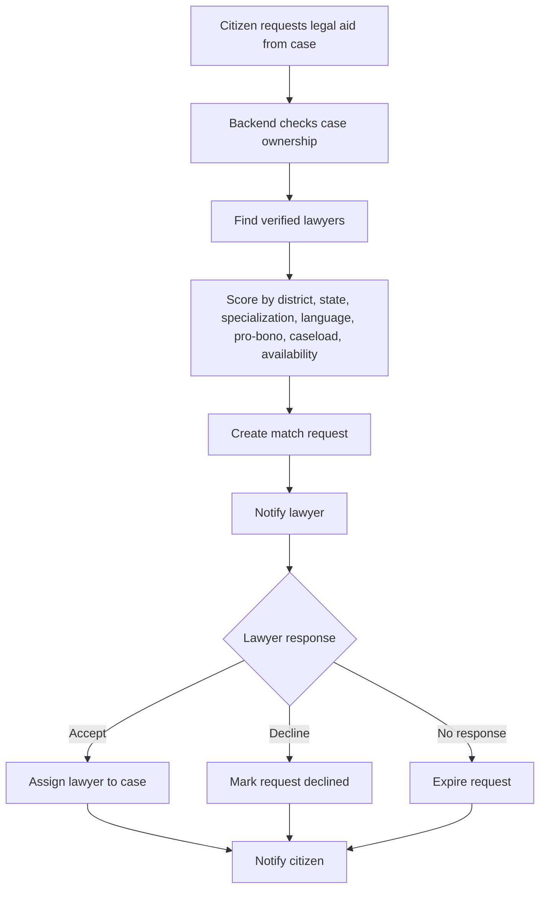

Matching score:

```text
District match: 25
State match: 15
Specialization match: 25
Language match: 10
Pro-bono availability: 15
Low active caseload: 10
Availability match: 10
Response reliability: 5
```

### 3.9 RTI Flow

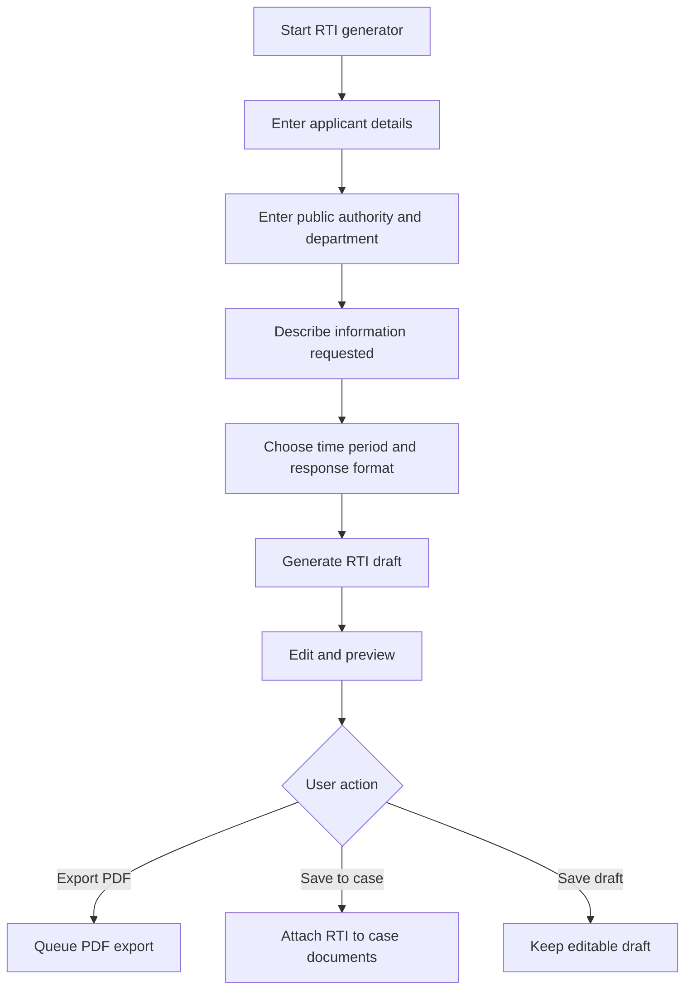

## 4. Lawyer Flow

### 4.1 Lawyer Onboarding and Verification

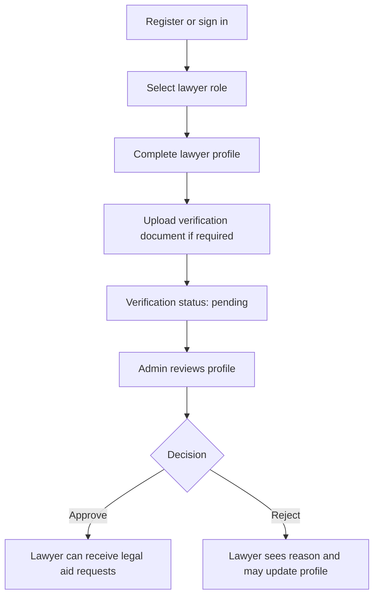

Profile requirements:

1. Full name.
2. Email.
3. Phone.
4. Bar Council registration number.
5. State Bar Council.
6. District of practice.
7. Specializations.
8. Languages.
9. Pro-bono availability.
10. Maximum active legal aid cases.
11. Availability schedule.

### 4.2 Lawyer Request Handling

```text
Lawyer dashboard
-> Pending requests
-> Open request detail
-> Review structured case summary
-> Accept or decline
-> If accepted, case appears in assigned cases
-> Citizen is notified
```

Lawyer cannot see private case documents until the request is accepted or the case is assigned by admin.

### 4.3 Assigned Case Work

```text
Assigned cases
-> Case detail
-> Review timeline, documents, hearings, drafts
-> Add case note
-> Update hearing outcome
-> Add next hearing date
-> Citizen receives relevant notification
```

## 5. Admin Flow

### 5.1 Admin Dashboard Flow

```text
Admin login
-> Admin dashboard
-> Review pending verification, flagged documents, notification failures, metrics
-> Open selected queue
-> Take action
-> Action is logged
```

### 5.2 Lawyer Verification Flow

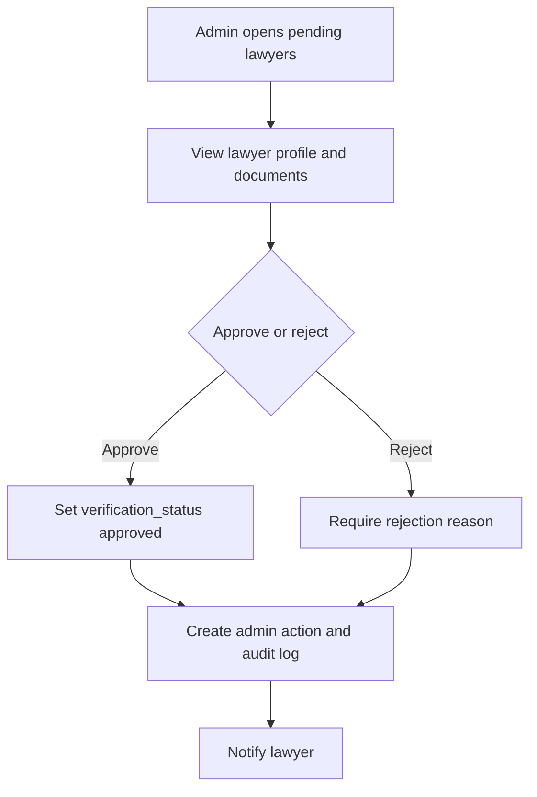

### 5.3 Legal Content Management Flow

```text
Admin opens legal content
-> Search existing section
-> Create or edit law section
-> Add source reference and plain-language explanation
-> Mark draft or reviewed
-> Search vector updates
-> Audit log created
```

### 5.4 Audit Review Flow

```text
Admin opens audit logs
-> Filter by actor, action, entity, date
-> Open event detail
-> Review metadata
-> Export/report later if required
```

## 6. Background System Flows

### 6.1 PDF Export

```text
Draft export requested
-> Validate draft ownership
-> Create export job
-> Worker renders PDF
-> Store PDF in private object storage
-> Create or update document metadata
-> Notify user
```

### 6.2 Notification Delivery

```text
Notification record created
-> Worker checks preferences
-> Worker sends via channel
-> Update status sent or failed
-> Retry failures with backoff
-> Prevent duplicate sends using idempotency key
```

### 6.3 OCR

```text
Document completed
-> OCR status processing
-> Textract/Tesseract extracts text
-> Store OCR text
-> OCR status completed or failed
-> Optional notification
```

## 7. Main User Journeys for MVP Testing

Citizen E2E:

1. Register as citizen.
2. Search law.
3. Complete assessment.
4. Generate complaint.
5. Create case from assessment.
6. Upload document.
7. Add hearing.
8. Request legal aid.
9. Generate RTI.

Lawyer E2E:

1. Register as lawyer.
2. Complete profile.
3. Wait for admin approval.
4. Receive legal aid request.
5. Accept request.
6. View assigned case.
7. Add hearing outcome.

Admin E2E:

1. Login as admin.
2. Verify lawyer.
3. Manage legal content.
4. View audit logs.
5. View platform metrics.
6. Review notification failures.

## 8. Critical Edge Cases

1. Unverified lawyer attempts to accept a request.
2. Citizen tries to access another citizen case.
3. Lawyer tries to access unassigned case documents.
4. Admin accesses sensitive case data without audit logging.
5. Duplicate hearing reminder job fires.
6. PDF export is requested twice.
7. OCR worker fails after upload.
8. Legal aid request expires without response.
9. User uploads unsupported file type.
10. Law search returns no results.
11. Deleted or archived case receives a new update.
12. Suspended user has a valid JWT.

## 9. State Transitions

### 9.1 Match Request

```text
pending -> accepted
pending -> declined
pending -> expired
pending -> cancelled
pending -> reassigned
```

### 9.2 Lawyer Verification

```text
pending -> approved
pending -> rejected
rejected -> pending
approved -> rejected
```

### 9.3 Document OCR

```text
not_started -> processing
processing -> completed
processing -> failed
failed -> processing
```

### 9.4 Draft

```text
draft -> exported
draft -> saved_to_case
exported -> saved_to_case
```

## 10. Flow Acceptance Criteria

1. Every protected flow starts with JWT validation and app user lookup.
2. Every case/document flow checks ownership or assignment.
3. Every sensitive admin action creates audit records.
4. Every long-running operation moves to background jobs.
5. User-facing flows provide recoverable states for failure.
6. Draft generation and assessment results display disclaimers.
7. Legal aid matching excludes unverified lawyers.
8. Reminder and notification flows are idempotent.
