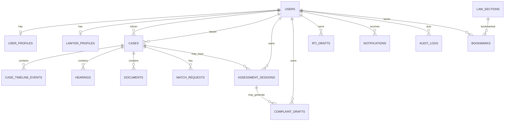

# Backend Schema
# Themis

## 1. Scope

This document defines the backend data model for Themis. The schema is based on the PRD and is optimized for a PostgreSQL-first modular monolith using SQLAlchemy 2.x and Alembic.

The model separates identity, profiles, legal content, assessments, drafts, cases, hearings, legal aid matching, documents, notifications, audit logs, bookmarks, and operational events.

## 2. Conventions

1. Primary keys use UUID.
2. Timestamps use timezone-aware `TIMESTAMPTZ`.
3. Mutable semi-structured fields use `JSONB`.
4. User-generated long text uses `TEXT`.
5. Legal tags and related sections can start as `TEXT[]`; normalize later only if query needs justify it.
6. Production passwords are not stored in this database.
7. Sensitive access is enforced by application policies and optionally PostgreSQL row-level security for case and document tables.
8. Soft deletion is preferred for sensitive legal records unless retention policy requires hard deletion.

## 3. Entity Relationship Overview



## 4. Enums

| Enum | Values |
|---|---|
| `user_role` | `citizen`, `lawyer`, `admin`, `org_user` |
| `verification_status` | `pending`, `approved`, `rejected` |
| `case_urgency` | `low`, `medium`, `high`, `emergency` |
| `case_status` | `draft`, `assessment_completed`, `complaint_prepared`, `complaint_submitted`, `fir_filed`, `under_investigation`, `legal_aid_requested`, `lawyer_assigned`, `in_court`, `hearing_scheduled`, `awaiting_order`, `closed`, `archived` |
| `law_review_status` | `draft`, `reviewed`, `deprecated` |
| `draft_status` | `draft`, `exported`, `saved_to_case` |
| `ocr_status` | `not_started`, `processing`, `completed`, `failed` |
| `document_access_level` | `case_private`, `lawyer_private`, `admin_review` |
| `malware_scan_status` | `not_scanned`, `clean`, `suspicious`, `failed` |
| `match_request_status` | `pending`, `accepted`, `declined`, `expired`, `cancelled`, `reassigned` |
| `notification_channel` | `email`, `sms`, `in_app` |
| `notification_status` | `pending`, `sent`, `failed` |
| `admin_action_status` | `success`, `failed` |
| `system_event_severity` | `info`, `warning`, `error`, `critical` |

## 5. Core Tables

### 5.1 `users`

Application-level account record synced from managed authentication.

| Column | Type | Constraints |
|---|---|---|
| `id` | UUID | PK |
| `external_auth_id` | VARCHAR(255) | UNIQUE, NOT NULL |
| `role` | `user_role` | NOT NULL |
| `email` | CITEXT | UNIQUE, NOT NULL |
| `phone` | VARCHAR(32) | NULL |
| `is_active` | BOOLEAN | NOT NULL DEFAULT true |
| `is_verified` | BOOLEAN | NOT NULL DEFAULT false |
| `last_login_at` | TIMESTAMPTZ | NULL |
| `created_at` | TIMESTAMPTZ | NOT NULL |
| `updated_at` | TIMESTAMPTZ | NOT NULL |

Indexes:

1. Unique index on `external_auth_id`.
2. Unique index on `email`.
3. Index on `role`.
4. Partial index on active users: `WHERE is_active = true`.

### 5.2 `user_profiles`

Citizen and shared user profile details.

| Column | Type | Constraints |
|---|---|---|
| `id` | UUID | PK |
| `user_id` | UUID | FK `users.id`, UNIQUE, NOT NULL |
| `full_name` | VARCHAR(160) | NOT NULL |
| `state` | VARCHAR(80) | NOT NULL |
| `district` | VARCHAR(120) | NOT NULL |
| `preferred_language` | VARCHAR(80) | NOT NULL DEFAULT 'English' |
| `address` | TEXT | NULL |
| `emergency_contact` | JSONB | NULL |
| `metadata` | JSONB | NOT NULL DEFAULT '{}' |
| `created_at` | TIMESTAMPTZ | NOT NULL |
| `updated_at` | TIMESTAMPTZ | NOT NULL |

Indexes:

1. Unique index on `user_id`.
2. Composite index on `(state, district)`.

### 5.3 `lawyer_profiles`

Lawyer-specific registration, availability, verification, and caseload details.

| Column | Type | Constraints |
|---|---|---|
| `id` | UUID | PK |
| `user_id` | UUID | FK `users.id`, UNIQUE, NOT NULL |
| `bar_number` | VARCHAR(80) | NOT NULL |
| `state_bar_council` | VARCHAR(120) | NOT NULL |
| `district` | VARCHAR(120) | NOT NULL |
| `specializations` | TEXT[] | NOT NULL DEFAULT '{}' |
| `languages` | TEXT[] | NOT NULL DEFAULT '{}' |
| `is_pro_bono` | BOOLEAN | NOT NULL DEFAULT false |
| `availability` | JSONB | NOT NULL DEFAULT '{}' |
| `max_active_cases` | INT | NOT NULL DEFAULT 3 |
| `active_case_count` | INT | NOT NULL DEFAULT 0 |
| `verification_status` | `verification_status` | NOT NULL DEFAULT 'pending' |
| `verification_notes` | TEXT | NULL |
| `verification_document_id` | UUID | FK `documents.id`, NULL, add FK after `documents` migration if needed |
| `rating` | NUMERIC(3,2) | NULL |
| `created_at` | TIMESTAMPTZ | NOT NULL |
| `updated_at` | TIMESTAMPTZ | NOT NULL |

Indexes:

1. Unique index on `user_id`.
2. Unique index on `(bar_number, state_bar_council)`.
3. GIN index on `specializations`.
4. GIN index on `languages`.
5. Composite index on `(verification_status, district, is_pro_bono)`.

### 5.4 `law_sections`

Curated legal knowledge records.

| Column | Type | Constraints |
|---|---|---|
| `id` | UUID | PK |
| `act_name` | VARCHAR(180) | NOT NULL |
| `section_number` | VARCHAR(80) | NOT NULL |
| `title` | VARCHAR(240) | NOT NULL |
| `original_text` | TEXT | NULL |
| `plain_language` | TEXT | NOT NULL |
| `example_scenarios` | TEXT[] | NOT NULL DEFAULT '{}' |
| `punishment` | TEXT | NULL |
| `is_bailable` | BOOLEAN | NULL |
| `is_cognizable` | BOOLEAN | NULL |
| `ipc_mapping` | VARCHAR(80) | NULL |
| `related_sections` | TEXT[] | NOT NULL DEFAULT '{}' |
| `category_tags` | TEXT[] | NOT NULL DEFAULT '{}' |
| `jurisdiction_notes` | TEXT | NULL |
| `source_reference` | TEXT | NULL |
| `review_status` | `law_review_status` | NOT NULL DEFAULT 'draft' |
| `last_reviewed_at` | TIMESTAMPTZ | NULL |
| `search_vector` | TSVECTOR | NULL |
| `created_at` | TIMESTAMPTZ | NOT NULL |
| `updated_at` | TIMESTAMPTZ | NOT NULL |

Indexes:

1. Unique index on `(act_name, section_number)`.
2. GIN index on `search_vector`.
3. GIN index on `category_tags`.
4. Trigram index on `title`.
5. Trigram index on `plain_language`.
6. Composite index on `(act_name, review_status)`.

### 5.5 `bookmarks`

Saved legal sections for users.

| Column | Type | Constraints |
|---|---|---|
| `id` | UUID | PK |
| `user_id` | UUID | FK `users.id`, NOT NULL |
| `law_section_id` | UUID | FK `law_sections.id`, NOT NULL |
| `created_at` | TIMESTAMPTZ | NOT NULL |

Indexes:

1. Unique index on `(user_id, law_section_id)`.
2. Index on `law_section_id`.

## 6. Assessment and Draft Tables

### 6.1 `assessment_sessions`

Stores guided assessment answers and generated informational result.

| Column | Type | Constraints |
|---|---|---|
| `id` | UUID | PK |
| `user_id` | UUID | FK `users.id`, NOT NULL |
| `case_id` | UUID | FK `cases.id`, NULL |
| `issue_category` | VARCHAR(120) | NOT NULL |
| `state` | VARCHAR(80) | NULL |
| `district` | VARCHAR(120) | NULL |
| `answers` | JSONB | NOT NULL DEFAULT '{}' |
| `suggested_sections` | TEXT[] | NOT NULL DEFAULT '{}' |
| `suggested_categories` | TEXT[] | NOT NULL DEFAULT '{}' |
| `evidence_checklist` | JSONB | NOT NULL DEFAULT '[]' |
| `result_summary` | TEXT | NULL |
| `ruleset_version` | VARCHAR(60) | NOT NULL |
| `disclaimer_accepted` | BOOLEAN | NOT NULL DEFAULT false |
| `created_at` | TIMESTAMPTZ | NOT NULL |
| `updated_at` | TIMESTAMPTZ | NOT NULL |

Indexes:

1. Index on `(user_id, created_at DESC)`.
2. Index on `case_id`.
3. Index on `issue_category`.
4. GIN index on `answers`.

### 6.2 `complaint_drafts`

Complaint or FIR-support draft records.

| Column | Type | Constraints |
|---|---|---|
| `id` | UUID | PK |
| `user_id` | UUID | FK `users.id`, NOT NULL |
| `case_id` | UUID | FK `cases.id`, NULL |
| `assessment_id` | UUID | FK `assessment_sessions.id`, NULL |
| `draft_text` | TEXT | NOT NULL |
| `structured_fields` | JSONB | NOT NULL DEFAULT '{}' |
| `status` | `draft_status` | NOT NULL DEFAULT 'draft' |
| `pdf_document_id` | UUID | FK `documents.id`, NULL |
| `created_at` | TIMESTAMPTZ | NOT NULL |
| `updated_at` | TIMESTAMPTZ | NOT NULL |

Indexes:

1. Index on `(user_id, created_at DESC)`.
2. Index on `case_id`.
3. Index on `assessment_id`.

### 6.3 `rti_drafts`

RTI application draft records.

| Column | Type | Constraints |
|---|---|---|
| `id` | UUID | PK |
| `user_id` | UUID | FK `users.id`, NOT NULL |
| `case_id` | UUID | FK `cases.id`, NULL |
| `public_authority` | VARCHAR(240) | NOT NULL |
| `department` | VARCHAR(180) | NULL |
| `information_requested` | TEXT | NOT NULL |
| `time_period` | VARCHAR(120) | NULL |
| `preferred_response_format` | VARCHAR(80) | NULL |
| `bpl_status` | BOOLEAN | NULL |
| `draft_text` | TEXT | NOT NULL |
| `structured_fields` | JSONB | NOT NULL DEFAULT '{}' |
| `status` | `draft_status` | NOT NULL DEFAULT 'draft' |
| `pdf_document_id` | UUID | FK `documents.id`, NULL |
| `created_at` | TIMESTAMPTZ | NOT NULL |
| `updated_at` | TIMESTAMPTZ | NOT NULL |

Indexes:

1. Index on `(user_id, created_at DESC)`.
2. Index on `case_id`.
3. Index on `public_authority`.

## 7. Case Management Tables

### 7.1 `cases`

Primary legal matter record.

| Column | Type | Constraints |
|---|---|---|
| `id` | UUID | PK |
| `citizen_id` | UUID | FK `users.id`, NOT NULL |
| `lawyer_id` | UUID | FK `users.id`, NULL |
| `title` | VARCHAR(240) | NOT NULL |
| `category` | VARCHAR(120) | NOT NULL |
| `state` | VARCHAR(80) | NOT NULL |
| `district` | VARCHAR(120) | NOT NULL |
| `urgency` | `case_urgency` | NOT NULL DEFAULT 'medium' |
| `fir_number` | VARCHAR(120) | NULL |
| `police_station` | VARCHAR(180) | NULL |
| `court_name` | VARCHAR(180) | NULL |
| `case_number` | VARCHAR(120) | NULL |
| `status` | `case_status` | NOT NULL DEFAULT 'draft' |
| `sections` | TEXT[] | NOT NULL DEFAULT '{}' |
| `description` | TEXT | NOT NULL |
| `metadata` | JSONB | NOT NULL DEFAULT '{}' |
| `created_at` | TIMESTAMPTZ | NOT NULL |
| `updated_at` | TIMESTAMPTZ | NOT NULL |
| `archived_at` | TIMESTAMPTZ | NULL |

Indexes:

1. Index on `(citizen_id, created_at DESC)`.
2. Index on `(lawyer_id, created_at DESC)`.
3. Composite index on `(status, urgency)`.
4. Composite index on `(state, district, category)`.
5. GIN index on `sections`.

### 7.2 `case_timeline_events`

Immutable case timeline entries.

| Column | Type | Constraints |
|---|---|---|
| `id` | UUID | PK |
| `case_id` | UUID | FK `cases.id`, NOT NULL |
| `actor_id` | UUID | FK `users.id`, NULL |
| `event_type` | VARCHAR(100) | NOT NULL |
| `title` | VARCHAR(180) | NOT NULL |
| `description` | TEXT | NULL |
| `metadata` | JSONB | NOT NULL DEFAULT '{}' |
| `created_at` | TIMESTAMPTZ | NOT NULL |

Indexes:

1. Index on `(case_id, created_at DESC)`.
2. Index on `event_type`.

### 7.3 `hearings`

Court hearing records.

| Column | Type | Constraints |
|---|---|---|
| `id` | UUID | PK |
| `case_id` | UUID | FK `cases.id`, NOT NULL |
| `hearing_date` | DATE | NOT NULL |
| `hearing_time` | TIME | NULL |
| `court` | VARCHAR(180) | NOT NULL |
| `court_room` | VARCHAR(80) | NULL |
| `judge` | VARCHAR(160) | NULL |
| `purpose` | TEXT | NOT NULL |
| `outcome` | TEXT | NULL |
| `next_date` | DATE | NULL |
| `notes` | TEXT | NULL |
| `added_by` | UUID | FK `users.id`, NOT NULL |
| `reminder_status` | VARCHAR(80) | NOT NULL DEFAULT 'not_scheduled' |
| `created_at` | TIMESTAMPTZ | NOT NULL |
| `updated_at` | TIMESTAMPTZ | NOT NULL |

Indexes:

1. Index on `(case_id, hearing_date DESC)`.
2. Index on `hearing_date`.
3. Index on `(added_by, created_at DESC)`.

## 8. Legal Aid Matching Tables

### 8.1 `match_requests`

Legal aid request between a citizen case and lawyer.

| Column | Type | Constraints |
|---|---|---|
| `id` | UUID | PK |
| `case_id` | UUID | FK `cases.id`, NOT NULL |
| `citizen_id` | UUID | FK `users.id`, NOT NULL |
| `lawyer_id` | UUID | FK `users.id`, NOT NULL |
| `score` | INT | NOT NULL |
| `score_breakdown` | JSONB | NOT NULL DEFAULT '{}' |
| `status` | `match_request_status` | NOT NULL DEFAULT 'pending' |
| `message` | TEXT | NULL |
| `requested_at` | TIMESTAMPTZ | NOT NULL |
| `responded_at` | TIMESTAMPTZ | NULL |
| `expires_at` | TIMESTAMPTZ | NULL |

Indexes:

1. Index on `(case_id, status)`.
2. Index on `(lawyer_id, status, requested_at DESC)`.
3. Index on `(citizen_id, requested_at DESC)`.
4. Partial unique index to prevent duplicate pending requests: `(case_id, lawyer_id) WHERE status = 'pending'`.

## 9. Document Tables

### 9.1 `documents`

Private document metadata. File bytes live in object storage.

| Column | Type | Constraints |
|---|---|---|
| `id` | UUID | PK |
| `case_id` | UUID | FK `cases.id`, NULL |
| `uploaded_by` | UUID | FK `users.id`, NOT NULL |
| `original_file_name` | VARCHAR(255) | NOT NULL |
| `object_key` | VARCHAR(512) | UNIQUE, NOT NULL |
| `mime_type` | VARCHAR(120) | NOT NULL |
| `file_size` | BIGINT | NOT NULL |
| `file_hash` | VARCHAR(128) | NOT NULL |
| `document_type` | VARCHAR(100) | NOT NULL |
| `ocr_status` | `ocr_status` | NOT NULL DEFAULT 'not_started' |
| `ocr_text` | TEXT | NULL |
| `access_level` | `document_access_level` | NOT NULL DEFAULT 'case_private' |
| `malware_scan_status` | `malware_scan_status` | NOT NULL DEFAULT 'not_scanned' |
| `metadata` | JSONB | NOT NULL DEFAULT '{}' |
| `created_at` | TIMESTAMPTZ | NOT NULL |
| `updated_at` | TIMESTAMPTZ | NOT NULL |
| `deleted_at` | TIMESTAMPTZ | NULL |

Indexes:

1. Index on `(case_id, created_at DESC)`.
2. Index on `(uploaded_by, created_at DESC)`.
3. Unique index on `object_key`.
4. Index on `file_hash`.
5. GIN index on `to_tsvector('english', coalesce(ocr_text, ''))` if OCR search is enabled.
6. Partial index on suspicious files: `WHERE malware_scan_status = 'suspicious'`.

## 10. Notification and Audit Tables

### 10.1 `notifications`

In-app, email, and SMS notification records.

| Column | Type | Constraints |
|---|---|---|
| `id` | UUID | PK |
| `user_id` | UUID | FK `users.id`, NOT NULL |
| `type` | VARCHAR(100) | NOT NULL |
| `title` | VARCHAR(180) | NOT NULL |
| `message` | TEXT | NOT NULL |
| `channel` | `notification_channel` | NOT NULL |
| `status` | `notification_status` | NOT NULL DEFAULT 'pending' |
| `idempotency_key` | VARCHAR(180) | UNIQUE, NOT NULL |
| `metadata` | JSONB | NOT NULL DEFAULT '{}' |
| `sent_at` | TIMESTAMPTZ | NULL |
| `read_at` | TIMESTAMPTZ | NULL |
| `created_at` | TIMESTAMPTZ | NOT NULL |

Indexes:

1. Index on `(user_id, created_at DESC)`.
2. Index on `(status, channel)`.
3. Unique index on `idempotency_key`.

### 10.2 `notification_preferences`

Per-user notification settings.

| Column | Type | Constraints |
|---|---|---|
| `id` | UUID | PK |
| `user_id` | UUID | FK `users.id`, UNIQUE, NOT NULL |
| `email_enabled` | BOOLEAN | NOT NULL DEFAULT true |
| `sms_enabled` | BOOLEAN | NOT NULL DEFAULT false |
| `in_app_enabled` | BOOLEAN | NOT NULL DEFAULT true |
| `hearing_reminders_enabled` | BOOLEAN | NOT NULL DEFAULT true |
| `legal_aid_updates_enabled` | BOOLEAN | NOT NULL DEFAULT true |
| `digest_enabled` | BOOLEAN | NOT NULL DEFAULT false |
| `created_at` | TIMESTAMPTZ | NOT NULL |
| `updated_at` | TIMESTAMPTZ | NOT NULL |

### 10.3 `audit_logs`

Security and sensitive operation audit trail.

| Column | Type | Constraints |
|---|---|---|
| `id` | UUID | PK |
| `actor_id` | UUID | FK `users.id`, NULL |
| `action` | VARCHAR(120) | NOT NULL |
| `entity_type` | VARCHAR(120) | NOT NULL |
| `entity_id` | UUID | NULL |
| `metadata` | JSONB | NOT NULL DEFAULT '{}' |
| `ip_address` | INET | NULL |
| `user_agent` | TEXT | NULL |
| `created_at` | TIMESTAMPTZ | NOT NULL |

Indexes:

1. Index on `(actor_id, created_at DESC)`.
2. Index on `(entity_type, entity_id)`.
3. Index on `(action, created_at DESC)`.

### 10.4 `admin_actions`

Admin-specific moderation and verification activity.

| Column | Type | Constraints |
|---|---|---|
| `id` | UUID | PK |
| `admin_id` | UUID | FK `users.id`, NOT NULL |
| `action` | VARCHAR(120) | NOT NULL |
| `target_type` | VARCHAR(120) | NOT NULL |
| `target_id` | UUID | NOT NULL |
| `reason` | TEXT | NULL |
| `status` | `admin_action_status` | NOT NULL DEFAULT 'success' |
| `metadata` | JSONB | NOT NULL DEFAULT '{}' |
| `created_at` | TIMESTAMPTZ | NOT NULL |

Indexes:

1. Index on `(admin_id, created_at DESC)`.
2. Index on `(target_type, target_id)`.

### 10.5 `system_events`

Operational events for workers, integrations, and platform health.

| Column | Type | Constraints |
|---|---|---|
| `id` | UUID | PK |
| `event_type` | VARCHAR(120) | NOT NULL |
| `severity` | `system_event_severity` | NOT NULL DEFAULT 'info' |
| `source` | VARCHAR(120) | NOT NULL |
| `message` | TEXT | NOT NULL |
| `metadata` | JSONB | NOT NULL DEFAULT '{}' |
| `created_at` | TIMESTAMPTZ | NOT NULL |

Indexes:

1. Index on `(severity, created_at DESC)`.
2. Index on `(event_type, created_at DESC)`.

## 11. Recommended Migration Order

1. Extensions: `uuid-ossp` or `pgcrypto`, `citext`, `pg_trgm`.
2. Enums.
3. `users`.
4. `user_profiles`.
5. `law_sections`, `bookmarks`.
6. `cases`.
7. `assessment_sessions`.
8. `documents`.
9. `lawyer_profiles` and optional verification document FK.
10. `complaint_drafts`, `rti_drafts`.
11. `case_timeline_events`, `hearings`.
12. `match_requests`.
13. `notifications`, `notification_preferences`.
14. `audit_logs`, `admin_actions`, `system_events`.
15. Search indexes and triggers.
16. Optional row-level security policies.

## 12. Search Vector Strategy

`law_sections.search_vector` should weight fields:

```sql
setweight(to_tsvector('english', coalesce(act_name, '')), 'A') ||
setweight(to_tsvector('english', coalesce(section_number, '')), 'A') ||
setweight(to_tsvector('english', coalesce(title, '')), 'A') ||
setweight(to_tsvector('english', coalesce(plain_language, '')), 'B') ||
setweight(to_tsvector('english', array_to_string(category_tags, ' ')), 'C')
```

The MVP may maintain this with a PostgreSQL trigger or application-side update in the repository layer.

## 13. Row-Level Access Policy Targets

Application authorization is mandatory. PostgreSQL RLS can be added for these high-risk tables:

1. `cases`.
2. `documents`.
3. `hearings`.
4. `assessment_sessions`.
5. `complaint_drafts`.
6. `rti_drafts`.
7. `match_requests`.

Policy principle:

1. Citizen can read and write records where `citizen_id` or `user_id` equals current app user.
2. Lawyer can read assigned case data where `cases.lawyer_id` equals current app user.
3. Admin access should be limited to admin workflows and logged.

## 14. Seed Data Requirements

Initial seed data should include:

1. Legal issue categories.
2. Curated law sections for BNS, IPC mappings, RTI Act, Motor Vehicles Act, IT Act, Consumer Protection Act, Domestic Violence Act, POCSO, SC/ST Prevention of Atrocities Act, workplace harassment, cheque bounce, property disputes, and cybercrime.
3. Assessment rule definitions.
4. Admin user bootstrap configuration.
5. Sample notification templates.

## 15. Data Retention Notes

1. Closed cases should support archival.
2. Audit logs should follow a defined retention policy and should not be casually deleted.
3. Documents should support logical deletion first, then lifecycle deletion according to retention rules.
4. Analytics must use aggregated or anonymized data.
5. Account deletion should preserve legally necessary audit records while removing or anonymizing personal profile data where permitted.
