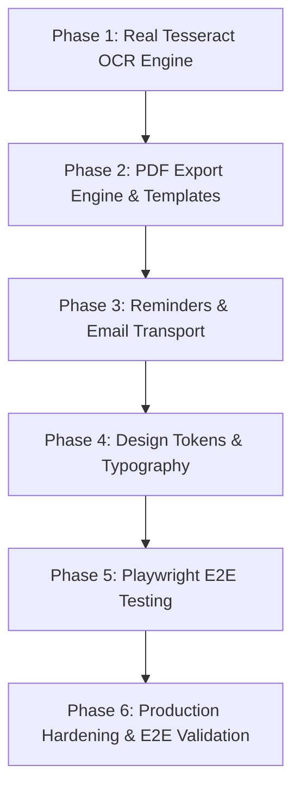

# Themis — Comprehensive Implementation Plan Forward

## 1. Executive Summary & Objective

This implementation plan outlines the precise engineering steps required to transition **Themis** from its current prototype state to 100% feature completeness and total alignment with the project specifications (`PRD`, `TRD`, `UI/UX Design Specification`, and `Phase 4 UML & Normalization`).

### Identified Gaps to be Resolved:
1. **Real Tesseract OCR Worker Engine**: Transition from seed metadata fallback to actual Tesseract OCR extraction on MinIO-stored document binaries.
2. **Automated PDF Rendering & Storage Pipeline**: Replace the 2-line stub task in Celery with real Jinja2 HTML rendering and PDF conversion (WeasyPrint/ReportLab), uploading generated files to MinIO.
3. **Scheduled Hearing Reminders & Email Delivery**: Implement Celery Beat cron scheduling for upcoming court hearings and wire email transport (SMTP/Mailpit/SES) for notification delivery.
4. **UI/UX Design System & Typography Alignment**: Implement the brand design system (Deep Navy `#1B2A41`, Justice Gold `#C9A24B`, Warm White `#FAF9F6`, Alert Terracotta `#B5502D`) and import Google Font **Source Serif 4**.
5. **Frontend Playwright E2E Suite**: Create end-to-end test scripts in `apps/web/tests/` covering Citizen, Lawyer, and Admin user journeys.

---

## 2. Milestone Roadmap & Task Breakdown



---

## Phase 1: Real Tesseract OCR Worker Engine

### Goal
Implement asynchronous OCR processing for PDF/Image documents uploaded to MinIO S3 storage using Tesseract OCR.

### Step-by-Step Backend Tasks:
1. **Dependencies**: Add `pytesseract` and `pdf2image` (with `Pillow`) to `apps/api/pyproject.toml`. Ensure Tesseract binary (`tesseract-ocr` & `poppler-utils`) is installed in `apps/api/Dockerfile`.
2. **MinIO Object Retrieval**: In `apps/api/app/tasks/document_ocr.py`, use the MinIO client (`app.core.storage` or `boto3`/MinIO SDK) to stream file bytes for `document.object_key`.
3. **Text Extraction Logic**:
   * For images (`image/png`, `image/jpeg`): Run `pytesseract.image_to_string(PIL.Image.open(bytes))`.
   * For PDFs (`application/pdf`): Convert pages to PIL images using `pdf2image.convert_from_bytes(pdf_bytes)` and execute Tesseract on each page.
4. **Database & Status Update**:
   * Set `document.ocr_status = OcrStatus.COMPLETED` and store extracted text in `document.ocr_text`.
   * On failure, log error into `document.metadata_json["ocr_error"]` and set `document.ocr_status = OcrStatus.FAILED`.
   * Record audit log entry for `ocr.completed` or `ocr.failed`.

### Acceptance Criteria:
* Uploading an image or PDF document triggers background OCR processing that populates `ocr_text` in PostgreSQL without manual metadata seeds.

---

## Phase 2: Automated PDF Export Engine & Jinja2 Templates

### Goal
Generate formatted, printable PDF files for Complaint Drafts and RTI Applications using Jinja2 templates and WeasyPrint / ReportLab, storing them in MinIO S3 storage.

### Step-by-Step Backend Tasks:
1. **Template Setup**: Create template directory `apps/api/app/templates/` with HTML/CSS templates:
   * `rti_application.html`: Official RTI format per Right to Information Act 2005.
   * `legal_complaint.html`: Formal legal complaint layout with citizen/respondent details, statement of facts, statutory provisions, and prayer for relief.
2. **PDF Engine Service**: Create `apps/api/app/services/pdf_generator.py` utilizing `weasyprint` (or `ReportLab` fallback) to compile Jinja2 rendered HTML into a PDF byte stream.
3. **Celery Worker Implementation**: Update `render_pdf_export(draft_id, draft_type)` in `apps/api/app/tasks/exports.py`:
   * Fetch draft from DB (`RTIDraft` or `ComplaintDraft`).
   * Render HTML template with draft data.
   * Generate PDF binary stream.
   * Upload PDF object to MinIO under key `exports/{draft_type}/{draft_id}.pdf`.
   * Create or update linked `Document` record in PostgreSQL (`mime_type="application/pdf"`, `ocr_status="not_needed"`).
   * Update draft status to `DraftStatus.EXPORTED`.

### Acceptance Criteria:
* Clicking "Export PDF" on an RTI or Complaint draft triggers the background worker, generates a PDF, uploads it to MinIO, and provides a presigned download link.

---

## Phase 3: Scheduled Hearing Reminders & Email Delivery Engine

### Goal
Schedule background reminders for upcoming court hearings and dispatch notifications to users via email.

### Step-by-Step Backend Tasks:
1. **Hearing Reminder Cron (`reminders.py`)**:
   * Query database for hearings where `hearing_date` is tomorrow (`T+1 day`) or in 3 days (`T+3 days`).
   * Check idempotency in notifications table to prevent duplicate reminders (`idempotency_key="reminder:hearing:{id}:{date}"`).
   * Create `Notification` record with status `PENDING`.
2. **Notification Delivery Worker (`notifications.py`)**:
   * Implement `deliver_notification(notification_id)`.
   * Build email transport (SMTP via Mailpit in development, AWS SES in production).
   * Send formatted email template (Hearing Date, Court Name, Purpose, Case Title).
   * Mark notification as `SENT` with `sent_at` timestamp, or `FAILED` with retry backoff.

### Acceptance Criteria:
* Hearings scheduled within 24-72 hours automatically trigger reminder notifications and dispatch emails visible in Mailpit (`http://localhost:8025`).

---

## Phase 4: UI/UX Design Tokens & Typography Polish

### Goal
Align the Next.js frontend with the target visual identity and design tokens specified in `Themis_UI_UX_Design.md` and `README.md`.

### Step-by-Step Frontend Tasks:
1. **Design Tokens Configuration**: Update `apps/web/tailwind.config.ts` and `apps/web/app/globals.css`:
   ```css
   :root {
     --color-navy: #1B2A41;       /* Deep Navy - Institutional trust */
     --color-warm-white: #FAF9F6; /* Warm White - High readability background */
     --color-gold: #C9A24B;       /* Justice Gold - Milestones & active highlights */
     --color-slate: #5B6570;      /* Slate Grey - Secondary text & chrome */
     --color-terracotta: #B5502D; /* Alert Terracotta - Critical deadlines */
   }
   ```
2. **Typography Integration**: Import Google Font **Source Serif 4** in `apps/web/app/layout.tsx` for brand title, section headers, and law section view. Keep **Inter** for forms, tables, and body copy.
3. **3-Panel Layout & Case Journey Timeline**:
   * Update `AppShell` (`apps/web/components/layout/app-shell.tsx`) to render the 3-panel layout (Navigation Rail, Workspace, Context Summary).
   * Polish the `Case Journey Timeline` component with milestone indicators (`Assessment` → `Document Filed` → `Attorney Assigned` → `Hearing Scheduled` → `Resolved`) using Justice Gold for completed steps.

### Acceptance Criteria:
* The web app exhibits the Deep Navy / Justice Gold palette, Source Serif 4 headings, Warm White background, and full 3-panel layout responsiveness.

---

## Phase 5: Automated Playwright E2E Test Suite

### Goal
Implement end-to-end browser test automation in `apps/web/tests/` covering critical user journeys.

### Step-by-Step Testing Tasks:
1. **Setup**: Install `@playwright/test` in `apps/web/package.json` and configure `playwright.config.ts`.
2. **Test Scripts**:
   * `tests/citizen-assessment.spec.ts`: Citizen login -> dynamic assessment wizard -> legal pathway recommendation -> complaint draft generation.
   * `tests/document-upload.spec.ts`: Citizen document drag-and-drop -> presigned upload to MinIO -> OCR text status verification.
   * `tests/legal-aid-match.spec.ts`: Citizen legal aid request -> Lawyer inbox -> Lawyer acceptance -> Case assignment update.
   * `tests/admin-verification.spec.ts`: Admin login -> Lawyer verification queue -> Bar credentials approval -> Audit log entry.

### Acceptance Criteria:
* `npm run test:e2e` in `apps/web` executes Playwright tests headlessly against the stack and passes 100%.

---

## Phase 6: Production Hardening, Audit & Pilot Verification

### Goal
Validate system resilience, security rules, RBAC policies, and complete final readiness checklist.

### Steps:
1. Run database migrations: `docker compose run --rm api alembic upgrade head`.
2. Execute backend pytest suite: `docker compose run --rm api pytest`.
3. Execute frontend Playwright suite: `npm run test:e2e` inside `apps/web`.
4. Validate `http://localhost:8000/api/v1/health/ready` and security headers.
5. Complete `docs/pilot-e2e-checklist.md` verification.

---

## 3. Implementation Verification Checklist

| Component | Task | Target File | Verification Method |
|---|---|---|---|
| **OCR Pipeline** | PyTesseract & pdf2image extraction | `apps/api/app/tasks/document_ocr.py` | Upload test image, check `document.ocr_text` in DB |
| **PDF Generator** | Jinja2 + HTML to PDF worker export | `apps/api/app/tasks/exports.py` | Trigger RTI export, download presigned PDF from MinIO |
| **Reminders** | Hearing reminder cron & email delivery | `apps/api/app/tasks/reminders.py` | Check Mailpit (`:8025`) for hearing reminder email |
| **UI Design System** | Palette & Source Serif 4 typography | `apps/web/tailwind.config.ts`, `globals.css` | Inspect frontend typography and color tokens |
| **E2E Tests** | Playwright automated user journey tests | `apps/web/tests/*.spec.ts` | Run `npx playwright test` |
