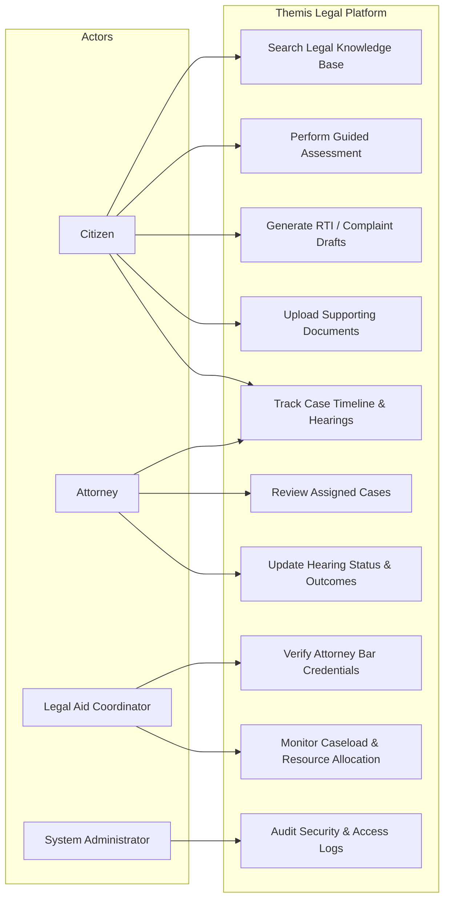
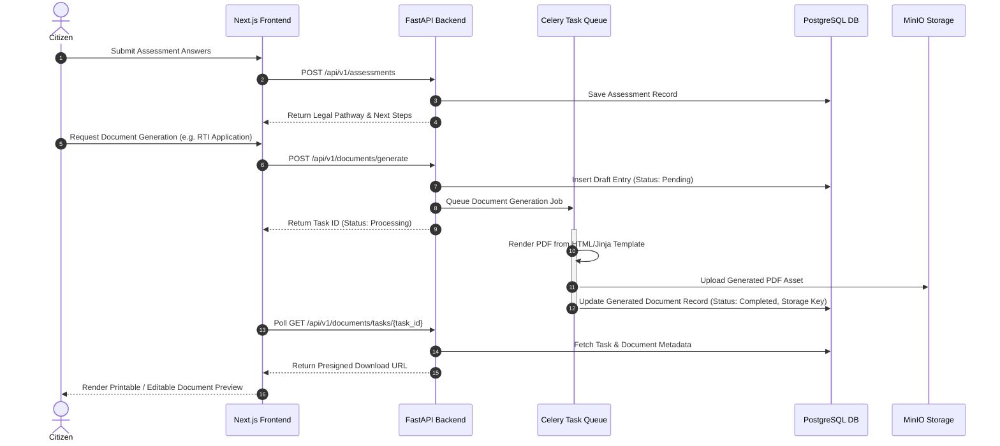
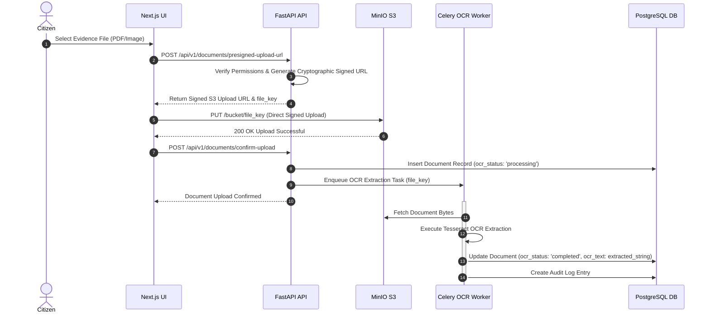
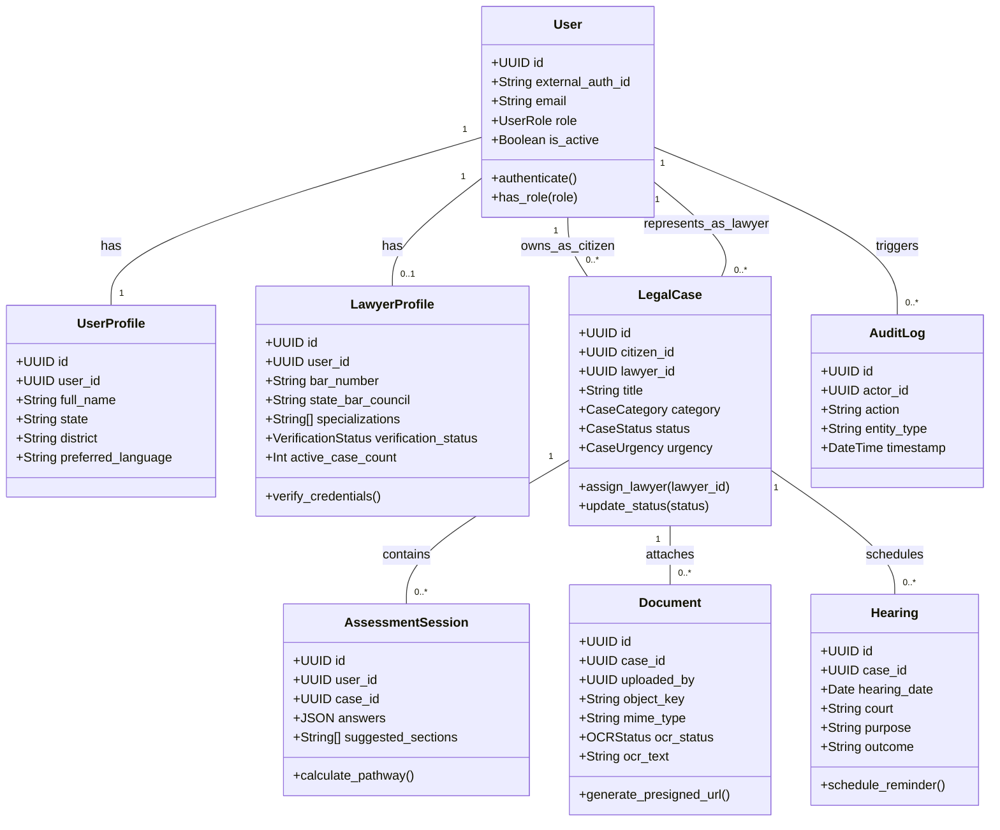

# Themis: Phase 4 — UML Diagrams, Table Design, Normalization & UI Customization

**System Architecture, Comprehensive UML Diagrams, Normalized Database Schema & Design Customization**

This technical artifact directly supports and formalizes the architecture, entity schema, and visual design.

---

### Authors / Team
- **A R Devadathan** (Backend API & Schema Lead)
- **Abiya John** (Frontend Dashboard Lead)
- **Amal K R** (Document, OCR & Case Engine Lead)

---

## 1. System Architecture & Template Customization

### 1.1 Architectural Overview
Themis is designed as a high-performance, modular legal-tech platform tailored for the Indian legal ecosystem. The system adopts a **decoupled architecture**:
* **Frontend Layer**: Next.js (React / TypeScript) utilizing customized UI layout templates, responsive multi-panel structures, and Tailwind / CSS design tokens.
* **Backend API Layer**: FastAPI framework utilizing Pydantic v2 validation models, Dependency Injection for authentication & session management, and SQLAlchemy 2.x ORM.
* **Asynchronous Task Engine**: Celery backed by RabbitMQ for background tasks including Optical Character Recognition (OCR), automated document generation (PDF/DOCX), and notification dispatching.
* **Storage Layer**: Relational PostgreSQL database for structured data management, accompanied by MinIO (S3-compatible object storage) for secure file assets.

```mermaid
graph TD
    subgraph Client Layer (Next.js Frontend)
        CitizenUI[Citizen Dashboard]
        AttorneyUI[Attorney Portal]
        CoordUI[Coordinator View]
    end

    subgraph API Layer (FastAPI Backend Monolith)
        AuthService[Auth & RBAC Service]
        AssessmentEngine[Guided Assessment Engine]
        DocService[Document Generation Service]
        MatchEngine[Attorney Matching Engine]
        TimelineEngine[Case Timeline Service]
    end

    subgraph Async Task Layer (Celery Workers)
        OCRWorker[OCR Extraction Worker]
        PDFWorker[PDF Generation Worker]
        NotifWorker[Notification Dispatcher]
        RabbitMQ[(RabbitMQ Broker)]
    end

    subgraph Data & Storage Layer
        PostgresDB[(PostgreSQL Database)]
        MinIOStore[(MinIO S3 Storage)]
    end

    CitizenUI <--> AuthService
    CitizenUI <--> AssessmentEngine
    AttorneyUI <--> TimelineEngine
    CoordUI <--> MatchEngine

    AuthService <--> PostgresDB
    AssessmentEngine <--> PostgresDB
    DocService --> RabbitMQ
    MatchEngine <--> PostgresDB
    TimelineEngine <--> PostgresDB

    RabbitMQ --> OCRWorker
    RabbitMQ --> PDFWorker
    RabbitMQ --> NotifWorker

    OCRWorker <--> MinIOStore
    OCRWorker --> PostgresDB
    PDFWorker --> MinIOStore
    PDFWorker --> PostgresDB
```

---

### 1.2 Customization on Templates
The UI design plan translates legal-aid workflows into modern, approachable template designs:
1. **Design Palette Customization**:
   * **Deep Navy (`#1B2A41`)**: Formality & institutional trust for headers, navigation rails, and core structural chrome.
   * **Warm White (`#FAF9F6`)**: Low-strain background tone enhancing readability for citizens with limited digital literacy.
   * **Justice Gold (`#C9A24B`)**: Visual accent for completed timeline milestones, active badges, and brand emblems.
   * **Alert Terracotta (`#B5502D`)**: High-priority alert state for imminent hearing dates and required citizen actions.
2. **Layout Templates**:
   * **Citizen 3-Panel Layout**: Left persistent navigation rail, central active workspace (Assessment / Preview), right contextual summary panel.
   * **Attorney Data-Dense Portal**: KPI summary cards header, filterable data-grid case table with real-time status badges.

---

## 2. UML Diagrams

### 2.1 Use Case Diagram
Visualizes interactions between platform actors (**Citizen**, **Attorney**, **Legal Aid Coordinator**, **Administrator**) and core system capabilities.



---

### 2.2 Sequence Diagram: Guided Legal Assessment & Document Generation
Illustrates the chronological interaction flow for generating a pre-filled complaint or RTI application.



---

### 2.3 Sequence Diagram: Document Upload & Asynchronous OCR Pipeline
Demonstrates the secure upload of supporting evidence and automated OCR text extraction.



---

### 2.4 Class Diagram
Models core domain entities, data relationships, and operations across backend services.



---

## 3. Detailed Table Design (SQL Schema DDL)

Below is the normalized relational PostgreSQL DDL definition for the primary platform entities.

```sql
-- 1. Enable Required PostgreSQL Extensions
CREATE EXTENSION IF NOT EXISTS "uuid-ossp";
CREATE EXTENSION IF NOT EXISTS "citext";
CREATE EXTENSION IF NOT EXISTS "pg_trgm";

-- 2. Enumerated Types
CREATE TYPE user_role AS ENUM ('citizen', 'lawyer', 'coordinator', 'admin');
CREATE TYPE verification_status AS ENUM ('pending', 'approved', 'rejected');
CREATE TYPE case_urgency AS ENUM ('low', 'medium', 'high', 'emergency');
CREATE TYPE case_status AS ENUM (
    'draft', 'assessment_completed', 'complaint_prepared', 
    'legal_aid_requested', 'lawyer_assigned', 'in_court', 
    'hearing_scheduled', 'resolved', 'closed'
);
CREATE TYPE ocr_status AS ENUM ('not_started', 'processing', 'completed', 'failed');
CREATE TYPE draft_status AS ENUM ('draft', 'exported', 'saved_to_case');

-- 3. Users Table
CREATE TABLE users (
    id UUID PRIMARY KEY DEFAULT uuid_generate_v4(),
    external_auth_id VARCHAR(255) UNIQUE NOT NULL,
    role user_role NOT NULL DEFAULT 'citizen',
    email CITEXT UNIQUE NOT NULL,
    phone VARCHAR(32),
    is_active BOOLEAN NOT NULL DEFAULT true,
    is_verified BOOLEAN NOT NULL DEFAULT false,
    created_at TIMESTAMPTZ NOT NULL DEFAULT CURRENT_TIMESTAMP,
    updated_at TIMESTAMPTZ NOT NULL DEFAULT CURRENT_TIMESTAMP
);

-- 4. User Profiles Table
CREATE TABLE user_profiles (
    id UUID PRIMARY KEY DEFAULT uuid_generate_v4(),
    user_id UUID UNIQUE NOT NULL REFERENCES users(id) ON DELETE CASCADE,
    full_name VARCHAR(160) NOT NULL,
    state VARCHAR(80) NOT NULL,
    district VARCHAR(120) NOT NULL,
    preferred_language VARCHAR(80) NOT NULL DEFAULT 'English',
    created_at TIMESTAMPTZ NOT NULL DEFAULT CURRENT_TIMESTAMP,
    updated_at TIMESTAMPTZ NOT NULL DEFAULT CURRENT_TIMESTAMP
);

-- 5. Lawyer Profiles Table
CREATE TABLE lawyer_profiles (
    id UUID PRIMARY KEY DEFAULT uuid_generate_v4(),
    user_id UUID UNIQUE NOT NULL REFERENCES users(id) ON DELETE CASCADE,
    bar_number VARCHAR(80) NOT NULL,
    state_bar_council VARCHAR(120) NOT NULL,
    district VARCHAR(120) NOT NULL,
    specializations TEXT[] NOT NULL DEFAULT '{}',
    is_pro_bono BOOLEAN NOT NULL DEFAULT true,
    verification_status verification_status NOT NULL DEFAULT 'pending',
    max_active_cases INT NOT NULL DEFAULT 5,
    active_case_count INT NOT NULL DEFAULT 0,
    created_at TIMESTAMPTZ NOT NULL DEFAULT CURRENT_TIMESTAMP,
    updated_at TIMESTAMPTZ NOT NULL DEFAULT CURRENT_TIMESTAMP,
    CONSTRAINT uq_bar_council UNIQUE (bar_number, state_bar_council)
);

-- 6. Cases Table
CREATE TABLE cases (
    id UUID PRIMARY KEY DEFAULT uuid_generate_v4(),
    citizen_id UUID NOT NULL REFERENCES users(id) ON DELETE CASCADE,
    lawyer_id UUID REFERENCES users(id) ON DELETE SET NULL,
    title VARCHAR(240) NOT NULL,
    category VARCHAR(120) NOT NULL,
    jurisdiction VARCHAR(120) NOT NULL,
    urgency case_urgency NOT NULL DEFAULT 'medium',
    status case_status NOT NULL DEFAULT 'draft',
    description TEXT NOT NULL,
    created_at TIMESTAMPTZ NOT NULL DEFAULT CURRENT_TIMESTAMP,
    updated_at TIMESTAMPTZ NOT NULL DEFAULT CURRENT_TIMESTAMP
);

-- 7. Assessment Sessions Table
CREATE TABLE assessment_sessions (
    id UUID PRIMARY KEY DEFAULT uuid_generate_v4(),
    user_id UUID NOT NULL REFERENCES users(id) ON DELETE CASCADE,
    case_id UUID REFERENCES cases(id) ON DELETE CASCADE,
    issue_category VARCHAR(120) NOT NULL,
    answers JSONB NOT NULL DEFAULT '{}',
    suggested_sections TEXT[] NOT NULL DEFAULT '{}',
    result_summary TEXT,
    created_at TIMESTAMPTZ NOT NULL DEFAULT CURRENT_TIMESTAMP,
    updated_at TIMESTAMPTZ NOT NULL DEFAULT CURRENT_TIMESTAMP
);

-- 8. Documents Table
CREATE TABLE documents (
    id UUID PRIMARY KEY DEFAULT uuid_generate_v4(),
    case_id UUID REFERENCES cases(id) ON DELETE CASCADE,
    uploaded_by UUID NOT NULL REFERENCES users(id) ON DELETE CASCADE,
    original_file_name VARCHAR(255) NOT NULL,
    object_key VARCHAR(512) UNIQUE NOT NULL,
    mime_type VARCHAR(120) NOT NULL,
    file_size BIGINT NOT NULL,
    ocr_status ocr_status NOT NULL DEFAULT 'not_started',
    ocr_text TEXT,
    created_at TIMESTAMPTZ NOT NULL DEFAULT CURRENT_TIMESTAMP,
    updated_at TIMESTAMPTZ NOT NULL DEFAULT CURRENT_TIMESTAMP
);

-- 9. Generated Documents Table
CREATE TABLE generated_documents (
    id UUID PRIMARY KEY DEFAULT uuid_generate_v4(),
    case_id UUID REFERENCES cases(id) ON DELETE CASCADE,
    user_id UUID NOT NULL REFERENCES users(id) ON DELETE CASCADE,
    document_type VARCHAR(100) NOT NULL, -- e.g., 'RTI Application', 'Complaint'
    content TEXT NOT NULL,
    status draft_status NOT NULL DEFAULT 'draft',
    created_at TIMESTAMPTZ NOT NULL DEFAULT CURRENT_TIMESTAMP,
    updated_at TIMESTAMPTZ NOT NULL DEFAULT CURRENT_TIMESTAMP
);

-- 10. Hearings Table
CREATE TABLE hearings (
    id UUID PRIMARY KEY DEFAULT uuid_generate_v4(),
    case_id UUID NOT NULL REFERENCES cases(id) ON DELETE CASCADE,
    hearing_date DATE NOT NULL,
    court VARCHAR(180) NOT NULL,
    purpose TEXT NOT NULL,
    outcome TEXT,
    added_by UUID NOT NULL REFERENCES users(id) ON DELETE CASCADE,
    created_at TIMESTAMPTZ NOT NULL DEFAULT CURRENT_TIMESTAMP,
    updated_at TIMESTAMPTZ NOT NULL DEFAULT CURRENT_TIMESTAMP
);

-- 11. Audit Logs Table
CREATE TABLE audit_logs (
    id UUID PRIMARY KEY DEFAULT uuid_generate_v4(),
    actor_id UUID REFERENCES users(id) ON DELETE SET NULL,
    action VARCHAR(120) NOT NULL,
    entity_type VARCHAR(120) NOT NULL,
    entity_id UUID,
    metadata JSONB NOT NULL DEFAULT '{}',
    created_at TIMESTAMPTZ NOT NULL DEFAULT CURRENT_TIMESTAMP
);

-- Performance Indexes
CREATE INDEX idx_users_email ON users(email);
CREATE INDEX idx_cases_citizen ON cases(citizen_id);
CREATE INDEX idx_cases_lawyer ON cases(lawyer_id);
CREATE INDEX idx_documents_case ON documents(case_id);
CREATE INDEX idx_hearings_case_date ON hearings(case_id, hearing_date DESC);
CREATE INDEX idx_audit_actor ON audit_logs(actor_id, created_at DESC);
```

---

## 4. Table Normalization Analysis

Database normalization ensures minimal data redundancy, eliminates modification anomalies (insertion, update, deletion anomalies), and enforces data integrity across all 8 platform tables.

### 4.1 First Normal Form (1NF)
* **Requirement**: Eliminate repeating groups, ensure atomic column values, and define a unique Primary Key for every table.
* **Transformation**:
  - In raw case data, a citizen might have had multiple hearing dates or multiple uploaded document names stored as comma-separated strings inside a single row.
  - **Resolution**: Separated all non-atomic fields into distinct dedicated tables (`hearings`, `documents`, `generated_documents`). Every column now holds scalar atomic values (or structured JSONB payloads for non-queryable answers). Unique `UUID` primary keys were established for all entities.

### 4.2 Second Normal Form (2NF)
* **Requirement**: Satisfy 1NF and ensure all non-key attributes are fully functionally dependent on the entire Primary Key (eliminating partial dependencies).
* **Transformation**:
  - Initially, attorney attributes (e.g. `bar_number`, `state_bar_council`, `verification_status`) and citizen attributes (e.g. `full_name`, `district`) resided inside a single flat `users` entity table.
  - **Resolution**: Split identity and profile entities. `users` holds global authentication credentials, while non-key profile attributes depend entirely on specialized keys in `user_profiles` and `lawyer_profiles` referenced via 1:1 foreign keys.

### 4.3 Third Normal Form (3NF)
* **Requirement**: Satisfy 2NF and ensure no non-key attribute depends transitively on another non-key attribute (eliminating transitive dependencies).
* **Transformation**:
  - In initial unnormalized drafts, case records contained attorney verification status or court room attributes directly inside the `cases` table. If an attorney's verification status changed, updating it across multiple case records caused update anomalies.
  - **Resolution**: Derived dependencies were removed from `cases`. Attorney verification is exclusively bound to `lawyer_profiles.verification_status`. Case timeline events, hearings, and audit logs reference Foreign Keys (`case_id`, `actor_id`) rather than duplicating user or case state text.

---

## 5. Phase 4 Verification & Deliverable Summary

| Requirement Item | Deliverable Description | Status |
|---|---|---|
| **UML Diagrams** | Complete Use Case, Sequence Diagrams (Assessment & Upload OCR), Class Diagram, Architecture Diagram | ✅ Complete |
| **Table Design (DDL)** | Full PostgreSQL DDL script with PKs, FKs, Enum types, indexes, and constraints | ✅ Complete |
| **Table Normalization** | Comprehensive 1NF, 2NF, 3NF analysis explaining anomaly elimination | ✅ Complete |
| **Design Customization** | Next.js template customization, design tokens (Deep Navy, Justice Gold, Alert Terracotta) | ✅ Complete |
